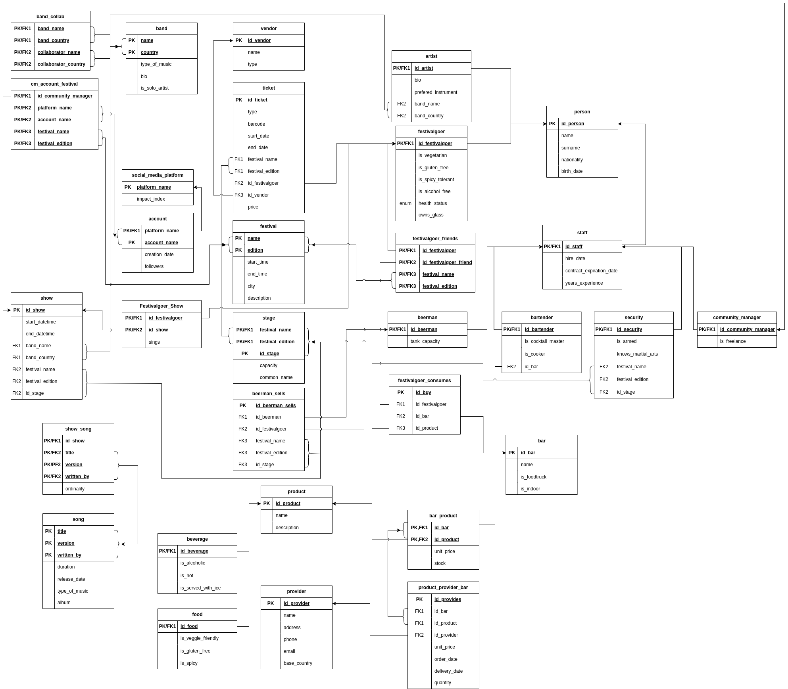

# Databases Challenge 2 — Music Festival Management

**Course:** [24303] Databases — Universitat Pompeu Fabra (UPF), Barcelona  
**Academic Year:** 2025–2026  
**Group:** 61  
**Database:** `G61_challange2_music_festival`

---

## Overview

This project is the second lab challenge for the Databases course at UPF. It is built on top of a music festival management database modelling real-world festivals (Primavera Sound, Tomorrowland, Creamfields, etc.) with ~25 interconnected tables covering attendees, staff, bands, shows, songs, bars, products, providers, tickets, and social media.

The challenge is split into two parts:

| Part | Points | Focus |
|------|--------|-------|
| Part 1 | 50 pts | Data import (ETL) + 16 SQL query views |
| Part 2 | 50 pts | PL/SQL: stored procedures, functions, triggers, and scheduled events |

---

## Database Schema

The diagram below shows all tables and their relationships:

**Core entities:**
- `person` — supertype for `festivalgoer` and `staff`
- `staff` — specialises into `beerman`, `bartender`, `security`, `community_manager`
- `festival` / `stage` / `show` — festival editions, venues, and performances
- `band` / `song` — artists and their catalogue
- `ticket` — links festivalgoers to festival editions
- `bar` / `product` / `provider` — venue commerce
- `account` / `social_media_platform` — social media management
- `eurofxref_hist` — ECB historical forex exchange rates (added in Part 1)

---

## Part 1 — Data Import & SQL Queries

### Data Import (`challenge2-load-data.sql`)

Imports the European Central Bank's historical EUR exchange rate dataset (`eurofxref-hist.csv`) into a new table `eurofxref_hist`. The table contains a `date` primary key and 31 currency columns (USD, GBP, JPY, CHF, etc.) with `DECIMAL(10,6)` precision. String values of `'N/A'` are converted to `NULL` on load using `LOAD DATA LOCAL INFILE`.

### 16 SQL Query Views (`challenge2-queries.sql`)

Each query is saved as a named view (`query_01` – `query_16`) and covers a wide range of SQL concepts:

| View | Topic | Concepts Used |
|------|-------|---------------|
| `query_01` | Count festivalgoers who don't own a glass; compute squirrels needed | `CEIL`, aggregation |
| `query_02` | Nationality distribution of festivalgoers | `GROUP BY`, `ORDER BY` |
| `query_03` | Non-spicy-tolerant festivalgoers who consumed spicy food and feel dizzy | Multi-table `JOIN`, filtering |
| `query_04` | Festivalgoers who attended shows without buying a ticket | `LEFT JOIN` + `IS NULL` (anti-join) |
| `query_05` | Bands with duplicate names | `GROUP BY` + `HAVING COUNT > 1` |
| `query_06` | Gluten-free, alcohol-free festivalgoers feeling "wasted", with stage info | Multi-table `JOIN`, multiple filters |
| `query_07` | Freelance community managers at Creamfields with 500k–700k followers | `JOIN` across staff/account tables, range filter |
| `query_08` | Beermans ranked by litres of beer sold at Primavera Sound | `ORDER BY`, arithmetic (0.33L/beer) |
| `query_09` | All songs by Rosalía across festivals, with total count and duration | Window functions (`SUM OVER`) |
| `query_10` | Providers who supplied veggie food consumed at Tomorrowland | Multi-hop `JOIN`, subquery |
| `query_11` | Shows ordered by total song duration descending | Aggregation, `ORDER BY` |
| `query_12` | Stage capacity usage percentage | Percentage calculation, `JOIN` |
| `query_13` | Festivalgoers who attended ALL editions of Primavera Sound | Relational division (`HAVING COUNT = subquery`) |
| `query_14` | Unemployment count per staff type | `UNION ALL`, anti-join per subtype |
| `query_15` | Staff counts per Primavera Sound edition (excluding bartenders) | `UNION`, `GROUP BY` edition |
| `query_16` | Total spending for a specific festivalgoer (tickets + beers + bar) | CTEs, multiple aggregations |

---

## Part 2 — PL/SQL Programming

### Req01 — Stored Procedure: Update Staff Experience (`Req01.sql`)

`req01_update_staff_experience()` — Recalculates and updates the `years_experience` column in the `staff` table using `TIMESTAMPDIFF(YEAR, hire_date, CURRENT_DATE())`. Only updates rows where the stored value is NULL or outdated.

### Req02 — Scheduled Event: Monthly Auto-Update (`Req02.sql`)

`req02_update_staff_experience_monthly` — Scheduled event that runs on the 1st of every month at 08:00, automatically calling `req01_update_staff_experience()`.

### Req03 — Trigger: Auto-Assign Bartender to Bar (`Req03.sql`)

`req03_auto_assign_bartender` — `BEFORE INSERT` trigger on the `bartender` table. If a new bartender has no bar assigned, it automatically assigns them to the bar with the fewest current bartenders, balancing workload across venues.

### Req04 — Stored Procedure: Fix Band Music Type (`Req04.sql`)

`req04_update_type_of_music()` — Uses a cursor to iterate over bands whose `type_of_music` doesn't match any song type in their catalogue. For each such band, it sets the type to the most common genre among their songs (random tiebreaker on draws).

### Req05 — Function: Round to 2 Decimal Places (`Req05.sql`)

`req05_rounded_decimal(x FLOAT)` — Returns the value unchanged if it already has ≤ 2 decimal places; otherwise rounds to exactly 2 decimals.

### Req06 — Function: Validate Currency Code (`Req06.sql`)

`req06_existence_curr_code(x CHAR(3))` — Returns `TRUE` if the given 3-character code is `'EUR'` or exists as a column name in the `eurofxref_hist` table (queried via `information_schema.COLUMNS`).

### Req07 — Stored Procedure: Currency Converter (`Req07.sql`)

`req07_convert_currency(Origin_Cur, Dest_Cur, Convert_Date, Amount_To_Convert INOUT, Error_Msg OUT)` — The most complex requirement. Converts an amount between two currencies using ECB historical rates, with full error handling:

- Amount must be > 0
- Date must not be in the future
- Cannot convert a currency to itself
- At least one of the two currencies must be EUR
- Both currency codes must be valid (uses `req06_existence_curr_code`)
- Exchange rate for the given date must exist and be positive
- Uses dynamic SQL (`PREPARE` / `EXECUTE`) to query the correct currency column
- Result rounded via `req05_rounded_decimal`

**Test evidence:**

| Test Case | Result |
|-----------|--------|
| 100 EUR → USD (2024-05-10) | 107.79 |
| 100 USD → EUR (2024-05-10) | 92.77 |
| Amount = 0 | Error |
| Future date | Error |
| Neither currency is EUR | Error |

### Req08 — Stored Procedure + Event: Extend Conversion Table (`Req08.sql`)

`req08_extend_conversion_table()` — Fills missing dates in `eurofxref_hist` from the last recorded date up to tomorrow. For each currency column, if the last known rate is 0 or NULL it inserts 0; otherwise it picks a random rate from the preceding 30-day window.

`req08_extend_conversion_table_daily` — Scheduled event running daily at 22:02 (group offset) to keep the table up to date.

---

## Files

| File | Description |
|------|-------------|
| `challenge2-load-data.sql` | Creates and populates the `eurofxref_hist` table from CSV |
| `challenge2-queries.sql` | 16 SQL views (query_01 – query_16) |
| `Req01.sql` – `Req08.sql` | PL/SQL requirements (procedures, functions, trigger, events) |
| `eurofxref-hist.csv` | ECB historical EUR exchange rate data |
| `models_festival_v2-MR-CS.png` | Entity-Relationship diagram of the database |
| `Req07_*.png` | Screenshots showing the currency converter in action |
| `QueriesPart1.docx` | Deliverable document for Part 1 queries |
| `RequirementsPart2.pdf` | Deliverable report for Part 2 requirements |

---

## Key SQL Concepts Covered

- `JOIN` (INNER, LEFT, multi-table)
- Subqueries and correlated subqueries
- Common Table Expressions (CTEs)
- Window functions (`SUM OVER`, `ROW_NUMBER`)
- `UNION` / `UNION ALL`
- Relational division
- `LOAD DATA LOCAL INFILE` (ETL)
- Stored procedures and cursors
- Scalar functions
- `BEFORE INSERT` triggers
- Scheduled events (`CREATE EVENT`)
- Dynamic SQL (`PREPARE` / `EXECUTE`)
- `information_schema` queries
